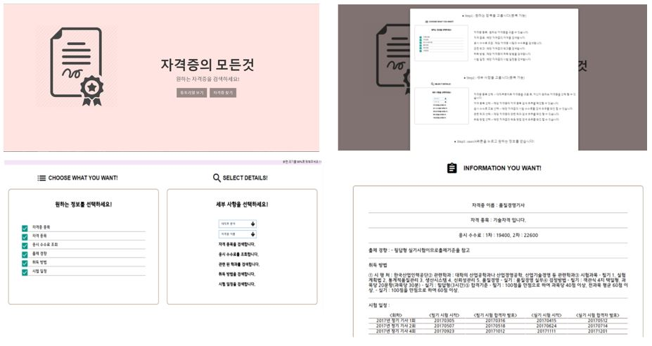

# certification_webservice

* Provide information easily to users who need information on certification using public data.
* Improve your prototype step by step and implement a web service tailored to your users.

## Function
1. Selection of qualifications
2. Selection of qualifications
3. Lookup commission inquiry
4. Inquiry tendency inquiry
5. Acquisition method inquiry
6. View the exam schedule

### Required
- HTML, CSS, Java Script, jQuery, XML, Json
